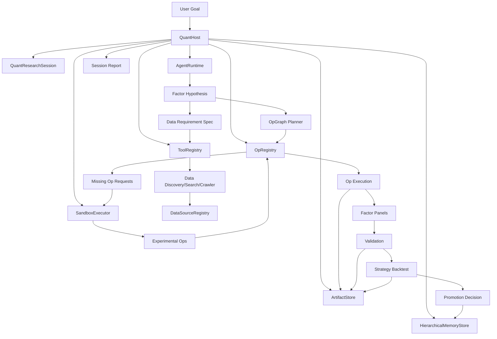

# Robin Refactor Guide for Codex

> 目标：指导 Codex / Claude Code / Grok Code 对 Robin 做系统级重构，把当前的 fixed factor multi-agent loop 升级为 **session-native、host-orchestrated、tool-enabled、op-extensible、hierarchical-memory 的 Agentic Quant Research Platform**。
>
> 本文档不是一份“灵感说明”，而是给 coding agent 执行 refactor 的工程规格。Codex 应按本文档拆分 patch、逐步落地、持续运行测试，并且不得破坏现有 offline synthetic smoke loop。

---

## 0. 给 Codex 的执行原则

你是负责 refactor `open-quant-agent` 的 senior coding agent。请严格遵守：

1. **不要一次性重写整个仓库。** 必须按 phase / patch 落地，每个 patch 都要可测试、可回滚。
2. **不要删除现有功能。** 当前 CLI、offline synthetic mode、factor validation、strategy backtest、memory 输出必须继续可用。
3. **MVP 不是阉割版。** MVP 需要完整闭环：Session、Host、Tool Registry、Op Registry、分层 Memory、Artifact Store、Audit Log、Offline Run 都要真实存在；允许某些高级 provider 是 stub / no-op / disabled，但接口和落盘必须完整。
4. **所有新增能力默认 research-only。** 禁止自动交易，禁止 broker / exchange integration，禁止生成实盘下单代码。
5. **LLM 不能直接执行任意生成代码。** 任何 generated op 必须先生成 spec，再生成 code，再经过 static review、unit test、small data smoke test、sandbox execution，才能进入 experimental op registry。
6. **所有 tool use 都要有 schema、权限、审计、输入输出记录。** 参考 MCP 和 Claude Code hooks 的做法，但实现为本仓库自己的轻量化 Tool Layer。
7. **所有数据与 feature artifact 都要可追踪 lineage。** 每个 artifact 必须知道来自哪个 session、哪个 op、哪个输入 hash、哪个数据源、哪个时间戳。
8. **所有 memory 写入必须 append-only + 可审计。** Summary 可以更新，但 raw event / experiment history 不允许被 silently rewrite。
9. **测试先行。** 每个 phase 都要增加/更新 tests；`pytest` 必须通过。
10. **优先保持小核心。** 参考 NanoClaw 的“小核心 + skills/op 扩展”思想，避免把所有可能的 datasource、crawler、LLM provider、quant factor 都塞进核心。

---

## 1. 背景与现状

当前 `open-quant-agent` 是一个 standalone multi-agent quant research loop。它已经具备：

- Research Agent：生成传统公式因子和可选 PyTorch sequence factor。
- Debate Agent：在实现前写 bullish / bearish / conservative validation case。
- Implementation Agent：通过 bounded feature DSL 编译公式因子，或训练 compact sequence model。
- Validation Agent：评估 IC、rank IC、OOS rank IC、decile spread、Sharpe、drawdown、coverage、stability。
- Fusion：支持 equal-weight、IC-weighted、stacking 等 factor fusion。
- Strategy Agent：把 accepted/watch factors 转成 top-k rotation strategy。
- Portfolio Backtest Agent：评估 OOS return、OOS Sharpe、drawdown、turnover、exposure、benchmark-relative excess。
- Memory：写 JSONL experiments、checkpoint、Markdown knowledge updates。
- Offline synthetic mode：用于 smoke test / CI，不依赖 API key。

当前模块大致为：

```text
src/open_quant_agent/
  agents.py
  cli.py
  data.py
  dl_factors.py
  feature_dsl.py
  hybrid_factors.py
  memory.py
  orchestrator.py
  schemas.py
  strategy_agents.py
```

当前主流程为：

```text
Research -> Debate -> Implementation -> Factor Backtest -> Hybrid Fusion
-> Strategy Construction -> Portfolio Backtest -> Strategy Promotion
-> Memory Update -> Supervisor Update -> Checkpoint
```

现有限制：

1. **Factor space 有限。** LLM/agent 目前主要在预定义 arm 和 feature expression 范围里组合，不能真正发明新数据源 + 新计算逻辑。
2. **Data source 有限。** 目前主要是 yfinance 和 deterministic synthetic OHLCV，缺少 datasource registry、data discovery、crawler/search。
3. **Feature DSL 可扩展性不足。** DSL 是安全的优点，但缺少 op graph、op versioning、op lifecycle、op tests、op provenance。
4. **没有 session-native 架构。** 当前 orchestrator 直接运行 cycle，缺少 QuantResearchSession、SessionStore、Transcript、Event Log、ArtifactStore。
5. **Memory 更像日志。** 当前有 experiments JSONL 和 Markdown KB，但还没有清晰的分层 memory、periodic summarization、query interface、memory compaction、skill/op memory。
6. **没有 tool use 子系统。** 缺少 SearchTool、CrawlerTool、SandboxTool、MemoryQueryTool、OpExecutionTool，以及 PreToolUse/PostToolUse 风格的审计和权限控制。
7. **没有 generated op 生命周期。** 无法让 LLM 安全地产生新 op，并经过 spec -> implementation -> test -> review -> experimental -> stable。
8. **缺少 replay。** session、tool call、op graph、memory write 不能完整重放。

---

## 2. 参考实践与设计启发

### 2.1 Claude Code 风格：project instructions + auto memory + hooks + skills

要参考但不要照抄 Claude Code：

- **Memory 分层**：Claude Code 使用 `CLAUDE.md` 作为人为维护的项目级持久指令，用 auto memory 保存模型从用户纠正中学到的经验；两者在 session 开始时加载为上下文。
- **规则作用域**：`CLAUDE.md`、`.claude/rules/`、path-scoped rules 可以减少上下文噪声。本项目应借鉴为 `memory/context_packs/`、`memory/project_rules.md`、`memory/op_rules/`。
- **Hooks**：Claude Code 的 `PreToolUse` / `PostToolUse` / `PermissionRequest` 思想可以迁移成本项目的 Tool Hook System：tool 执行前做权限、输入校验、risk scoring；执行后做 output validation、audit、memory extraction。
- **Skills**：Claude Code / NanoClaw 的 skill 思想适合迁移为本项目的 `ops/skills` 或 `research_skills`：不是把所有功能塞进 core，而是用 spec + reference implementation + tests 扩展。

### 2.2 NanoClaw 风格：不要信任 agent，小核心，隔离，按需扩展

NanoClaw 的核心思想对本项目非常重要：

- Agent 应被视为 untrusted process，而不是可信工程师。
- 安全边界不应依赖 prompt 或 allowlist，而应由 host / sandbox / filesystem / permission policy 执行。
- 每个 agent/session 应有隔离的 workspace、transcript、artifact。
- 核心代码保持小而可审计，功能通过 skill/op 扩展。
- 新能力要通过可读、可审、可测试的代码加入，而不是运行时任意执行。

迁移到本项目：

- `QuantHost` 是唯一有权组织 tool/op execution 的对象。
- `AgentRuntime` 只负责提议，不直接执行危险动作。
- `ToolRegistry` / `OpRegistry` 是执行边界。
- `SandboxExecutor` 是 generated op 的唯一执行入口。
- `PermissionPolicy` 必须在 host 层执行，不允许 agent 自己决定。

### 2.3 MCP 风格：工具必须有 schema、能力声明、结构化结果和审计

本项目不必立即实现完整 MCP server/client，但 Tool Layer 应学习 MCP 的基本形式：

- Tool 有 `name`、`description`、`input_schema`、`output_schema`、`permission_level`。
- Tool call 记录 `tool_call_id`、input、output、error、duration、side effects。
- Tool 输出尽量 structured，方便 LLM 和 validator 使用。
- 对敏感 tool call 支持 human-in-the-loop / deny / ask / allow。
- Tool list 动态可发现，但由 host 控制。

### 2.4 Quant agent / alpha factory 风格：自动化、可解释、可复现、可晋级

参考 Quant 4.0、FinRL/FinRL-X、alpha factory 类系统的公开思路，本项目要强化：

- **模块化 pipeline**：data -> feature -> model/factor -> validation -> strategy -> portfolio -> report。
- **可复现**：所有 session、数据、参数、随机种子、op version、artifact hash 必须记录。
- **自动化但可解释**：LLM 可以提出新 idea，但每个因子都必须有 economic intuition、failure mode、lookahead risk、validation gate。
- **分层晋级**：factor accepted 不等于 strategy accepted；op experimental 不等于 stable；datasource accepted 不等于可长期信任。
- **研究卫生**：point-in-time、walk-forward、purged split、survivorship bias、transaction cost、capacity、turnover 都应进入长期 roadmap。

### 2.5 HRT / Jump / 顶级量化工程实践的公开抽象原则

不要声称知道 HRT、Jump、Jane Street 等公司的内部系统实现。这里只抽象公开可推断的工程原则：

- 研究与工程不可分离。alpha research 不是 notebook demo，而是数据、计算、验证、部署边界、监控、复现共同组成的系统。
- 数据质量和 provenance 是 alpha research 的基础。
- 快速实验必须配合严格的 out-of-sample、benchmark-relative、turnover/cost/risk 检查。
- 小的 research artifact 要能沉淀为可复用能力：feature、dataset、validation test、report template、failure pattern。
- 研究系统要奖励“能被否定的假设”，而不是奖励漂亮叙事或漂亮回测图。

---

## 3. 新系统目标

把当前仓库升级为：

```text
Session-native Quant Research OS
  = QuantHost
  + QuantResearchSession
  + AgentRuntime
  + Tool Layer
  + Op Layer
  + Data Discovery
  + Hierarchical Memory
  + Artifact Store
  + Sandbox
  + Report/Replay
```

核心能力：

1. 用户用自然语言创建 research session。
2. Host 加载 memory/context，选择 runtime，组织 workflow。
3. Runtime 提出 FactorHypothesis，而不是只选已有 factor arm。
4. Runtime 规划 DataRequirementSpec。
5. Tool Layer 搜索/抓取/评估数据源。
6. Op Planner 构建 DataSourceOp -> TransformOp -> FeatureOp -> ValidationOp -> StrategyOp graph。
7. Op Registry 检测 missing op。
8. Coding Agent 为 missing op 生成 spec/code/tests。
9. SandboxExecutor 执行测试和 small-data smoke。
10. Experimental op 被注册并可执行。
11. Factor panel 被 materialize，写 artifact + lineage。
12. Validation / strategy / portfolio backtest 运行。
13. Promotion decision 进入 experiment memory。
14. Knowledge memory 周期总结经验。
15. Op/Skill memory 统计 op 可靠性和下游 alpha 贡献。
16. Session 可恢复、可审计、可 replay。

---

## 4. MVP 定义：完整闭环，而不是削弱版

MVP 需要在可行范围内完整实现架构闭环。允许高级逻辑先用 deterministic/template/stub，但所有接口、落盘、审计和最小功能必须存在。

### 4.1 MVP 必须实现

1. `QuantResearchSession`
   - session_id、goal、status、config、paths、created_at、updated_at。
   - 保存 `session.json`。
   - 写 `events.jsonl`、`transcript.jsonl`。
   - 支持 create / load / save / inspect / resume。

2. `QuantHost`
   - 创建/恢复 session。
   - 包装当前 `MultiAgentQuantOrchestrator`。
   - 加载 `MemoryStore`、`ToolRegistry`、`OpRegistry`。
   - 在 session 内运行当前 loop。
   - 写 host events 和 audit logs。

3. 分层 memory skeleton + 最小可用实现
   - Session Memory：session-local transcript/events/checkpoints/artifacts。
   - Experiment Memory：append-only JSONL，兼容现有 `multi_agent_experiments.jsonl`。
   - Knowledge Memory：Markdown summary，兼容现有 `FACTOR_KNOWLEDGE_BASE.md` / `STRATEGY_KNOWLEDGE_BASE.md`。
   - Op/Skill Memory：`op_registry.json`、`op_experience.jsonl`，MVP 可先记录 built-in op。
   - DataSource Memory：`datasource_registry.json`，MVP 至少记录 synthetic/yfinance。

4. Tool Layer skeleton + 最小可用 tools
   - `ToolSpec`、`ToolCall`、`ToolResult`、`ToolRegistry`。
   - `MemoryQueryTool`：查 experiment/knowledge/op memory。
   - `DataSearchTool`：MVP 在 no-network/offline 下返回 disabled result；online 下可预留 provider stub。
   - `CrawlerTool`：MVP disabled unless explicitly enabled；接口先落地。
   - `SandboxTool`：MVP 可执行受限 python unit test 命令，默认 no-network。
   - `OpExecutionTool`：执行 registered op。
   - 所有 tool call 进入 `tool_calls.jsonl`。

5. Op System skeleton + wrap existing pipeline
   - `BaseOp`、`DataSourceOp`、`TransformOp`、`FeatureOp`、`ValidationOp`、`StrategyOp`。
   - `OpRegistry`。
   - `OpGraph`。
   - 把 synthetic/yfinance data load 包装成 DataSourceOp。
   - 把现有 feature DSL build panel 包装成 FeatureOp。
   - 把现有 factor validation 包装成 ValidationOp。
   - 把 top-k strategy construction/backtest 包装成 StrategyOp 或 PortfolioBacktestOp。

6. Generated Op lifecycle skeleton
   - `GeneratedOpSpec`。
   - `GeneratedOpState` enum。
   - lifecycle 状态机和落盘。
   - MVP 不一定真的让 LLM 写复杂 op，但要能创建 missing op request、保存 spec、拒绝未测试 op 执行。

7. CLI
   - 保持旧 CLI：`open-quant-agent --offline-synthetic --max-iterations 1`。
   - 新 CLI：
     - `open-quant-agent session create --goal "..."`
     - `open-quant-agent session run <session_id> --offline-synthetic --max-iterations 1`
     - `open-quant-agent session inspect <session_id>`
     - `open-quant-agent op list`
     - `open-quant-agent memory query "..."`
   - MVP 中 search/crawler CLI 可以存在但默认说明 disabled/no-network。

8. Tests
   - session create/load/save。
   - host run offline synthetic。
   - legacy CLI smoke。
   - new CLI smoke。
   - memory append/query。
   - op registry list/execute synthetic datasource op。
   - tool audit log。
   - generated op lifecycle 不允许跳过 test 直接 stable。

### 4.2 MVP 不需要完成但必须预留接口

- 真正外部 LLM provider integration。
- 完整 MCP server/client。
- 完整 browser automation crawler。
- PDF full text parsing。
- 多容器 sandbox。
- 复杂 point-in-time join。
- 实时 market data。
- 向量数据库。
- 实盘交易或 broker integration：永远不做。

---

## 5. 目标目录结构

Codex 应逐步迁移到以下结构。第一批 patch 可以先创建 skeleton，不要一次性搬完所有现有文件。

```text
src/open_quant_agent/
  __init__.py

  cli.py                         # keep existing entrypoint; add subcommands

  host/
    __init__.py
    host.py                       # QuantHost
    config.py                     # HostConfig, PermissionPolicy
    events.py                     # HostEvent, EventWriter

  sessions/
    __init__.py
    models.py                     # QuantResearchSession, SessionStatus, SessionConfig
    store.py                      # SessionStore
    paths.py                      # SessionPaths helpers
    transcript.py                 # transcript/event appenders

  runtime/
    __init__.py
    base.py                       # AgentRuntime protocol
    local_template.py             # wrapper for current deterministic agents
    replay.py                     # replay transcript/events
    llm.py                        # provider abstraction only; no hard dependency
    coding_agent.py               # generated op coding runtime abstraction

  agents/
    __init__.py
    factor_discovery.py           # new structured hypothesis workflow
    data_planner.py
    op_planner.py
    source_evaluator.py
    result_interpreter.py

  ops/
    __init__.py
    base.py                       # BaseOp and schemas
    registry.py                   # OpRegistry
    graph.py                      # OpGraph, OpNode, OpEdge
    lifecycle.py                  # GeneratedOp lifecycle
    specs.py                      # GeneratedOpSpec, OpIO schema
    builtin/
      __init__.py
      datasource.py               # SyntheticOHLCVOp, YFinanceOHLCVOp
      feature_dsl_ops.py          # wraps feature_dsl.py
      validation_ops.py           # wraps hybrid_factors validation
      strategy_ops.py             # wraps strategy_agents.py
    generated/
      __init__.py
      README.md                   # generated ops live outside core import by default

  tools/
    __init__.py
    base.py                       # ToolSpec, ToolCall, ToolResult
    registry.py                   # ToolRegistry
    hooks.py                      # PreToolUse/PostToolUse style hooks
    permissions.py                # ToolPermission enum, policy decisions
    memory_tools.py
    op_tools.py
    sandbox_tools.py
    search_tools.py
    crawler_tools.py

  data/
    __init__.py                   # keep old data helpers or re-export
    discovery/
      __init__.py
      models.py                   # SearchResult, DataSourceEvaluation
      search.py                   # SearchTool backend abstraction
      crawler.py                  # crawler abstraction, disabled by default
      evaluator.py
    registry.py                   # DataSourceRegistry
    cache.py                      # DataCache, provenance metadata
    provenance.py                 # DataLineage, ArtifactLineage

  memory/
    __init__.py
    store.py                      # HierarchicalMemoryStore
    session_memory.py
    experiment_memory.py
    knowledge_memory.py
    op_skill_memory.py
    datasource_memory.py
    summarizer.py                 # periodic summarization abstraction
    query.py                      # memory query API
    models.py

  sandbox/
    __init__.py
    executor.py                   # SandboxExecutor
    policy.py                     # no-network, mounts, timeout, env
    review.py                     # static code review helpers

  artifacts/
    __init__.py
    store.py                      # ArtifactStore
    models.py                     # ArtifactRef, ArtifactKind, Lineage

  workflows/
    __init__.py
    legacy_loop.py                # session wrapper over current orchestrator
    factor_discovery.py           # new workflow skeleton
    generated_op_workflow.py

  reports/
    __init__.py
    session_report.py
    markdown.py

  # Existing modules retained during migration
  agents.py
  data.py
  dl_factors.py
  feature_dsl.py
  hybrid_factors.py
  memory.py
  orchestrator.py
  schemas.py
  strategy_agents.py
```

---

## 6. Session 文件系统布局

每个 session 都必须独立落盘，可恢复、可审计、可 replay。

```text
runs/
  sessions/
    {session_id}/
      session.json
      status.json
      transcript.jsonl
      events.jsonl
      tool_calls.jsonl
      op_runs.jsonl
      memory_writes.jsonl
      checkpoints/
        checkpoint_0001.json
        checkpoint_0002.json
      artifacts/
        raw_data/
        cleaned_data/
        features/
        factor_panels/
        validations/
        strategies/
        backtests/
        reports/
      generated_ops/
        {op_id}/
          spec.json
          implementation.py
          tests.py
          review.json
          lifecycle.json
      generated_specs/
      validation/
      strategy/
      reports/
        session_report.md
```

Global memory / registry：

```text
memory/
  experiments.jsonl
  experiment_index.json
  factor_knowledge.md
  strategy_knowledge.md
  datasource_knowledge.md
  failure_patterns.md
  op_experience.jsonl
  memory_summaries.jsonl
  context_packs/
    project_rules.md
    research_hygiene.md
    op_generation_rules.md

registries/
  op_registry.json
  datasource_registry.json
  tool_registry.json

.agent_state/
  # preserve compatibility with current state/checkpoint paths during migration
```

---

## 7. Core Data Models and Interfaces

Prefer dataclasses for low dependency and compatibility with current repo. Pydantic can be added later if needed, but MVP should avoid unnecessary dependency churn.

### 7.1 QuantResearchSession

```python
# src/open_quant_agent/sessions/models.py
from __future__ import annotations

from dataclasses import asdict, dataclass, field
from enum import Enum
from pathlib import Path
from typing import Any
from open_quant_agent.schemas import utc_now, stable_id


class SessionStatus(str, Enum):
    CREATED = "created"
    RUNNING = "running"
    PAUSED = "paused"
    COMPLETED = "completed"
    FAILED = "failed"


@dataclass
class SessionConfig:
    offline_synthetic: bool = True
    no_network: bool = True
    max_iterations: int = 1
    universe_size: int = 48
    period: str = "3y"
    interval: str = "1d"
    fusion_method: str = "ic_weighted"
    runtime_name: str = "local_template"
    permission_profile: str = "research_safe"


@dataclass
class QuantResearchSession:
    session_id: str
    user_goal: str
    created_at: str
    updated_at: str
    status: SessionStatus = SessionStatus.CREATED
    config: SessionConfig = field(default_factory=SessionConfig)
    tags: list[str] = field(default_factory=list)
    universe_spec: dict[str, Any] = field(default_factory=dict)
    data_requirements: list[dict[str, Any]] = field(default_factory=list)
    factor_hypotheses: list[dict[str, Any]] = field(default_factory=list)
    planned_ops: list[dict[str, Any]] = field(default_factory=list)
    executed_ops: list[dict[str, Any]] = field(default_factory=list)
    artifacts: list[dict[str, Any]] = field(default_factory=list)
    validation_results: list[dict[str, Any]] = field(default_factory=list)
    strategy_results: list[dict[str, Any]] = field(default_factory=list)
    memory_writes: list[dict[str, Any]] = field(default_factory=list)
    error: dict[str, Any] | None = None

    @classmethod
    def create(cls, user_goal: str, config: SessionConfig | None = None) -> "QuantResearchSession":
        now = utc_now()
        session_id = stable_id({"goal": user_goal, "created_at": now}, prefix="qrs_")
        return cls(
            session_id=session_id,
            user_goal=user_goal,
            created_at=now,
            updated_at=now,
            config=config or SessionConfig(),
        )

    def touch(self) -> None:
        self.updated_at = utc_now()

    def to_dict(self) -> dict[str, Any]:
        payload = asdict(self)
        payload["status"] = self.status.value
        return payload
```

### 7.2 SessionStore

```python
# src/open_quant_agent/sessions/store.py
from __future__ import annotations

import json
from dataclasses import fields
from pathlib import Path
from typing import Any
from open_quant_agent.sessions.models import QuantResearchSession, SessionConfig, SessionStatus


class SessionStore:
    def __init__(self, root: Path = Path("runs/sessions")) -> None:
        self.root = root

    def create(self, user_goal: str, config: SessionConfig | None = None) -> QuantResearchSession:
        session = QuantResearchSession.create(user_goal=user_goal, config=config)
        self.save(session)
        self.ensure_layout(session.session_id)
        self.append_event(session.session_id, "session_created", {"goal": user_goal})
        return session

    def path_for(self, session_id: str) -> Path:
        return self.root / session_id

    def ensure_layout(self, session_id: str) -> None:
        base = self.path_for(session_id)
        for rel in [
            "checkpoints",
            "artifacts/raw_data",
            "artifacts/cleaned_data",
            "artifacts/features",
            "artifacts/factor_panels",
            "artifacts/validations",
            "artifacts/strategies",
            "artifacts/backtests",
            "artifacts/reports",
            "generated_ops",
            "generated_specs",
            "validation",
            "strategy",
            "reports",
        ]:
            (base / rel).mkdir(parents=True, exist_ok=True)

    def load(self, session_id: str) -> QuantResearchSession:
        path = self.path_for(session_id) / "session.json"
        data = json.loads(path.read_text(encoding="utf-8"))
        config_data = data.pop("config", {})
        data["config"] = SessionConfig(**config_data)
        data["status"] = SessionStatus(data.get("status", "created"))
        allowed = {f.name for f in fields(QuantResearchSession)}
        return QuantResearchSession(**{k: v for k, v in data.items() if k in allowed})

    def save(self, session: QuantResearchSession) -> None:
        base = self.path_for(session.session_id)
        base.mkdir(parents=True, exist_ok=True)
        session.touch()
        (base / "session.json").write_text(
            json.dumps(session.to_dict(), indent=2, sort_keys=True, ensure_ascii=False),
            encoding="utf-8",
        )

    def append_event(self, session_id: str, event_type: str, payload: dict[str, Any]) -> None:
        from open_quant_agent.memory import append_jsonl
        from open_quant_agent.schemas import utc_now
        append_jsonl(self.path_for(session_id) / "events.jsonl", {
            "timestamp": utc_now(),
            "event_type": event_type,
            "payload": payload,
        })
```

### 7.3 QuantHost

```python
# src/open_quant_agent/host/host.py
from __future__ import annotations

from dataclasses import dataclass
from pathlib import Path
from typing import Any

from open_quant_agent.orchestrator import OrchestratorConfig, MultiAgentQuantOrchestrator
from open_quant_agent.sessions.models import QuantResearchSession, SessionConfig, SessionStatus
from open_quant_agent.sessions.store import SessionStore
from open_quant_agent.memory.store import HierarchicalMemoryStore
from open_quant_agent.tools.registry import ToolRegistry
from open_quant_agent.ops.registry import OpRegistry


@dataclass
class HostConfig:
    sessions_root: Path = Path("runs/sessions")
    memory_root: Path = Path("memory")
    registry_root: Path = Path("registries")
    default_state_dir: Path = Path(".agent_state")


class QuantHost:
    """Owns orchestration. Agents propose; host executes and records."""

    def __init__(self, config: HostConfig | None = None) -> None:
        self.config = config or HostConfig()
        self.sessions = SessionStore(self.config.sessions_root)
        self.memory = HierarchicalMemoryStore(self.config.memory_root)
        self.tools = ToolRegistry.default()
        self.ops = OpRegistry.default(self.config.registry_root / "op_registry.json")

    def create_session(self, goal: str, session_config: SessionConfig | None = None) -> QuantResearchSession:
        session = self.sessions.create(goal, session_config)
        self.memory.append_session_event(session.session_id, "created", {"goal": goal})
        return session

    def run_session(self, session_id: str) -> list[dict[str, Any]]:
        session = self.sessions.load(session_id)
        session.status = SessionStatus.RUNNING
        self.sessions.save(session)
        self.sessions.append_event(session_id, "session_run_started", {"config": session.config.__dict__})

        try:
            records = self._run_legacy_loop(session)
            session.status = SessionStatus.COMPLETED
            session.validation_results.extend([r.get("best") for r in records if r.get("best")])
            session.strategy_results.extend([r.get("best_strategy") for r in records if r.get("best_strategy")])
            self.memory.append_experiments(records, session_id=session_id)
            self.sessions.append_event(session_id, "session_run_completed", {"records": len(records)})
            return records
        except Exception as exc:
            session.status = SessionStatus.FAILED
            session.error = {"type": type(exc).__name__, "message": str(exc)}
            self.sessions.append_event(session_id, "session_run_failed", session.error)
            raise
        finally:
            self.sessions.save(session)

    def _run_legacy_loop(self, session: QuantResearchSession) -> list[dict[str, Any]]:
        state_dir = self.sessions.path_for(session.session_id) / ".agent_state"
        config = OrchestratorConfig(
            max_iterations=session.config.max_iterations,
            period=session.config.period,
            interval=session.config.interval,
            offline_synthetic=session.config.offline_synthetic,
            state_dir=state_dir,
            universe_size=session.config.universe_size,
            fusion_method=session.config.fusion_method,
        )
        return MultiAgentQuantOrchestrator(config).run(session.config.max_iterations)
```

### 7.4 AgentRuntime

```python
# src/open_quant_agent/runtime/base.py
from __future__ import annotations

from typing import Any, Protocol
from open_quant_agent.sessions.models import QuantResearchSession


class AgentRuntime(Protocol):
    name: str

    def propose_factor_hypotheses(self, session: QuantResearchSession) -> list[dict[str, Any]]: ...
    def critique_factor_hypothesis(self, session: QuantResearchSession, hypothesis: dict[str, Any]) -> dict[str, Any]: ...
    def plan_data_requirements(self, session: QuantResearchSession, hypothesis: dict[str, Any]) -> dict[str, Any]: ...
    def plan_op_graph(self, session: QuantResearchSession, hypothesis: dict[str, Any], available_ops: list[dict[str, Any]]) -> dict[str, Any]: ...
    def generate_op_spec(self, session: QuantResearchSession, missing_op: dict[str, Any]) -> dict[str, Any]: ...
    def review_op_code(self, session: QuantResearchSession, op_spec: dict[str, Any], code: str) -> dict[str, Any]: ...
    def interpret_validation_results(self, session: QuantResearchSession, result: dict[str, Any]) -> dict[str, Any]: ...
    def propose_next_action(self, session: QuantResearchSession) -> dict[str, Any]: ...
```

---

## 8. Op System

### 8.1 Base Concepts

Op 是本系统的最小可复用计算单元。分为：

- `DataSourceOp`：采集或加载数据。
- `TransformOp`：清洗、对齐、join、标准化。
- `FeatureOp`：计算因子/feature panel。
- `ValidationOp`：IC、rank IC、OOS、decile、walk-forward、purged split。
- `StrategyOp`：factor -> portfolio strategy。
- `ReportOp`：生成报告。

### 8.2 BaseOp Interface

```python
# src/open_quant_agent/ops/base.py
from __future__ import annotations

from dataclasses import dataclass, field
from enum import Enum
from typing import Any, Protocol


class OpType(str, Enum):
    DATASOURCE = "datasource"
    TRANSFORM = "transform"
    FEATURE = "feature"
    VALIDATION = "validation"
    STRATEGY = "strategy"
    REPORT = "report"


class OpPermission(str, Enum):
    READ_LOCAL = "read_local"
    WRITE_ARTIFACTS = "write_artifacts"
    NETWORK_READ = "network_read"
    CODE_EXEC = "code_exec"
    GENERATED_CODE = "generated_code"


@dataclass
class OpIOSchema:
    name: str
    type: str
    description: str
    required: bool = True
    metadata: dict[str, Any] = field(default_factory=dict)


@dataclass
class OpSpec:
    op_id: str
    name: str
    version: str
    op_type: OpType
    description: str
    inputs: list[OpIOSchema]
    outputs: list[OpIOSchema]
    permissions: list[OpPermission] = field(default_factory=list)
    dependencies: list[str] = field(default_factory=list)
    cache_policy: dict[str, Any] = field(default_factory=dict)
    reliability: float = 0.5
    status: str = "stable"
    implementation_path: str | None = None
    test_path: str | None = None


@dataclass
class OpContext:
    session_id: str
    artifact_dir: str
    cache_dir: str
    no_network: bool = True
    metadata: dict[str, Any] = field(default_factory=dict)


@dataclass
class OpRunResult:
    op_id: str
    status: str
    outputs: dict[str, Any]
    artifacts: list[dict[str, Any]] = field(default_factory=list)
    metrics: dict[str, Any] = field(default_factory=dict)
    error: dict[str, Any] | None = None
    lineage: dict[str, Any] = field(default_factory=dict)


class BaseOp(Protocol):
    def spec(self) -> OpSpec: ...
    def validate_inputs(self, inputs: dict[str, Any]) -> None: ...
    def run(self, inputs: dict[str, Any], context: OpContext) -> OpRunResult: ...
    def validate_outputs(self, result: OpRunResult) -> None: ...
    def fingerprint(self, inputs: dict[str, Any]) -> str: ...
```

### 8.3 OpRegistry

```python
# src/open_quant_agent/ops/registry.py
from __future__ import annotations

import json
from pathlib import Path
from typing import Any
from open_quant_agent.ops.base import BaseOp, OpSpec


class OpRegistry:
    def __init__(self, registry_path: Path) -> None:
        self.registry_path = registry_path
        self._ops: dict[str, BaseOp] = {}

    @classmethod
    def default(cls, registry_path: Path) -> "OpRegistry":
        registry = cls(registry_path)
        # Register built-ins lazily to avoid importing heavy modules.
        try:
            from open_quant_agent.ops.builtin.datasource import SyntheticOHLCVOp, YFinanceOHLCVOp
            registry.register(SyntheticOHLCVOp())
            registry.register(YFinanceOHLCVOp())
        except Exception:
            pass
        return registry

    def register(self, op: BaseOp) -> None:
        spec = op.spec()
        if spec.op_id in self._ops:
            raise ValueError(f"duplicate op_id: {spec.op_id}")
        self._ops[spec.op_id] = op
        self.persist_specs()

    def get(self, op_id: str) -> BaseOp:
        return self._ops[op_id]

    def list_specs(self) -> list[OpSpec]:
        return [op.spec() for op in self._ops.values()]

    def find_by_type(self, op_type: str) -> list[OpSpec]:
        return [spec for spec in self.list_specs() if spec.op_type.value == op_type]

    def persist_specs(self) -> None:
        self.registry_path.parent.mkdir(parents=True, exist_ok=True)
        payload = [spec.__dict__ for spec in self.list_specs()]
        self.registry_path.write_text(json.dumps(payload, indent=2, default=str), encoding="utf-8")
```

### 8.4 Generated Op Spec

```python
# src/open_quant_agent/ops/specs.py
from __future__ import annotations

from dataclasses import dataclass, field
from typing import Any, Literal


GeneratedOpKind = Literal["datasource", "transform", "feature", "validation", "strategy"]


@dataclass
class GeneratedOpSpec:
    op_id: str
    op_type: GeneratedOpKind
    version: str
    description: str
    economic_or_data_intuition: str
    inputs: list[dict[str, Any]]
    outputs: list[dict[str, Any]]
    permissions: list[str]
    dependencies: list[str]
    cache_policy: dict[str, Any]
    implementation_constraints: list[str]
    point_in_time_requirements: list[str]
    lookahead_risks: list[str]
    test_cases: list[dict[str, Any]]
    review_checklist: list[str]
    source_notes: list[dict[str, Any]] = field(default_factory=list)
```

### 8.5 Generated Op Lifecycle

State machine：

```text
proposed
  -> specified
  -> implemented
  -> unit_tested
  -> sandbox_tested
  -> reviewed
  -> experimental
  -> stable
  -> deprecated
  -> failed
```

Gate：

| State | Required Gate |
| --- | --- |
| proposed | MissingOpRequest created by OpPlanner; includes why existing ops cannot satisfy requirement. |
| specified | GeneratedOpSpec exists; input/output schema, permissions, tests, lookahead risks declared. |
| implemented | Code file created under session generated_ops; no registry execution yet. |
| unit_tested | Unit tests pass locally in sandbox/no-network mode. |
| sandbox_tested | Small synthetic data smoke test passes; no unauthorized file/network access. |
| reviewed | Static review passes; generated code does not import forbidden modules or access secrets. |
| experimental | Registered in experimental registry; can run only with explicit session permission. |
| stable | Used successfully across N sessions and M datasets; reliability threshold met. |
| deprecated | Bad performance, unreliable source, obsolete API, or better op exists. |
| failed | Any hard gate fails; reason recorded in op_experience.jsonl. |

禁止：

- `proposed -> implemented` 跳过 spec。
- `implemented -> experimental` 跳过 tests/review。
- `experimental -> stable` 没有 usage/reliability evidence。
- Generated datasource op 默认请求 network permission。

---

## 9. Tool Use System

### 9.1 Tool Base Types

```python
# src/open_quant_agent/tools/base.py
from __future__ import annotations

from dataclasses import dataclass, field
from enum import Enum
from typing import Any, Protocol


class ToolPermission(str, Enum):
    READ_ONLY = "read_only"
    FILE_WRITE = "file_write"
    NETWORK_READ = "network_read"
    CODE_EXEC = "code_exec"
    GENERATED_CODE_EXEC = "generated_code_exec"


@dataclass
class ToolSpec:
    name: str
    description: str
    input_schema: dict[str, Any]
    output_schema: dict[str, Any]
    permission: ToolPermission
    enabled_by_default: bool = True
    requires_human_approval: bool = False


@dataclass
class ToolCall:
    tool_call_id: str
    session_id: str
    tool_name: str
    arguments: dict[str, Any]
    timestamp: str


@dataclass
class ToolResult:
    tool_call_id: str
    status: str
    output: dict[str, Any]
    error: dict[str, Any] | None = None
    duration_ms: int | None = None
    side_effects: list[dict[str, Any]] = field(default_factory=list)


class Tool(Protocol):
    def spec(self) -> ToolSpec: ...
    def run(self, call: ToolCall) -> ToolResult: ...
```

### 9.2 Hook System

实现轻量版：

```text
PreToolUse:
  - validate input schema
  - check permission policy
  - block network if no_network=True
  - block writes outside session/artifact dirs
  - block generated code exec unless op lifecycle permits
  - optionally ask human / deny / allow

PostToolUse:
  - validate output schema
  - redact secrets if any
  - record audit log
  - extract memory candidate if useful
  - update tool reliability statistics

PostToolUseFailure:
  - record failure
  - attach corrective hints to session memory
```

### 9.3 Required Tools

MVP tools：

1. `memory.query`
   - 输入：query, memory_scopes, limit。
   - 输出：matching records/summaries。

2. `op.list`
   - 输入：op_type/status。
   - 输出：registered op specs。

3. `op.run`
   - 输入：op_id, inputs。
   - 输出：OpRunResult。

4. `sandbox.run_tests`
   - 输入：path, timeout, no_network。
   - 输出：test status/stdout/stderr。

5. `data.search`
   - MVP no-network returns disabled result unless explicitly enabled。
   - 未来接入 web search / API search。

6. `crawler.fetch`
   - MVP disabled。
   - 未来支持 robots/terms/rate-limit/cache/provenance。

---

## 10. Data Discovery 子系统

### 10.1 SearchResult

```python
@dataclass
class SearchResult:
    title: str
    url: str
    snippet: str
    source_type: str
    estimated_reliability: float
    terms_risk: str
    structured_data_likelihood: float
    proposed_datasource_op: dict[str, Any] | None = None
```

### 10.2 DataSourceEvaluation

```python
@dataclass
class DataSourceEvaluation:
    source_id: str
    reliability: float
    coverage: str
    freshness: str
    point_in_time_quality: str
    survivorship_bias_risk: str
    legal_terms_risk: str
    parser_complexity: str
    expected_alpha_relevance: float
    recommendation: str  # accept/watch/reject
    notes: list[str]
```

### 10.3 DataSourceRegistry

```python
@dataclass
class DataSourceRecord:
    source_id: str
    name: str
    url_or_api: str
    data_type: str
    coverage: str
    schema: dict[str, Any]
    license_note: str
    reliability_score: float
    parser_op_id: str | None
    known_failure_modes: list[str]
    last_checked: str | None
    usage_count: int = 0
```

### 10.4 Example: Insider Buy Pressure Factor

1. LLM proposes:

```text
Factor: Insider Buy Pressure
Intuition: clustered insider open-market purchases can signal positive private information.
Data required: SEC Form 4 filings, issuer CIK/ticker mapping, transaction code, transaction date, shares, price, officer/director relation.
Risk: Form 4 filing date vs transaction date lookahead; amendments; ticker mapping survivorship.
```

2. DataPlanner creates `DataRequirementSpec`:

```text
- SEC Form 4 filings
- point-in-time filing timestamp
- issuer/ticker mapping
- event window join to trading calendar
```

3. DataSearchTool finds possible source.
4. SourceEvaluatorAgent scores source.
5. OpPlanner creates graph:

```text
SECForm4SourceOp
  -> Form4NormalizeOp
  -> PointInTimeEventJoinOp
  -> InsiderBuyPressureFeatureOp
  -> RankICValidationOp
  -> LongShortQuantileStrategyOp
```

6. Missing ops become GeneratedOpSpec requests.
7. Sandbox tests generated ops against tiny fixture files.
8. Experimental ops execute only in this session.
9. Validation result writes experiment memory and op experience memory.

---

## 11. Hierarchical Memory

Memory 不是日志。Memory 是 agent 下一轮研究时可查询、可压缩、可更新、可审计的经验系统。

### 11.1 Memory Layers

#### Layer 0: Session Memory

Scope: 单次 session。

Files:

```text
runs/sessions/{session_id}/
  transcript.jsonl
  events.jsonl
  tool_calls.jsonl
  op_runs.jsonl
  checkpoints/
```

Contents:

- 用户目标。
- Agent proposals。
- Tool calls。
- Op graph。
- Validation results。
- Errors and recovery。
- Session-local context pack。

Usage:

- Resume session。
- Replay session。
- Debug tool/op failures。

#### Layer 1: Experiment Memory

Scope: 所有 session 的 raw experiment history。

Files:

```text
memory/experiments.jsonl
memory/experiment_index.json
```

Contents:

- hypothesis。
- data sources。
- ops used。
- factor metrics。
- strategy metrics。
- promotion result。
- failure reason。
- artifact refs。

Rule:

- append-only。
- 不允许 LLM rewrite。
- 可建立 index，但 index 可重建。

#### Layer 2: Knowledge Memory

Scope: 长期研究结论。

Files:

```text
memory/factor_knowledge.md
memory/strategy_knowledge.md
memory/datasource_knowledge.md
memory/failure_patterns.md
memory/memory_summaries.jsonl
```

Contents:

- 哪些 factor family 在哪些 universe/regime 有效。
- 哪些 validation gates 太松/太严。
- 哪些 data source 可靠或危险。
- 常见失败模式。
- 研究假设的经验规律。

Rule:

- Summary 可更新，但每次更新必须写 `memory_writes.jsonl`。
- Summary 要引用 raw experiment ids。
- Summary 不得删除不利证据。

#### Layer 3: Op / Skill Memory

Scope: 可复用实现能力。

Files:

```text
registries/op_registry.json
memory/op_experience.jsonl
memory/op_skill_memory.md
```

Contents:

- stable ops。
- experimental ops。
- deprecated ops。
- op tests。
- usage count。
- downstream factor performance。
- op failure modes。
- generated op review history。

Rule:

- Op promoted to stable 必须有证据。
- Op deprecated 必须有 reason。
- Op spec versioning 必须保留。

#### Layer 4: DataSource Memory

Scope: 数据源可信度与 schema。

Files:

```text
registries/datasource_registry.json
memory/datasource_knowledge.md
```

Contents:

- source coverage。
- freshness。
- point-in-time quality。
- legal/terms note。
- parser reliability。
- known failure modes。

#### Layer 5: Project / Policy Memory

Scope: coding agents 必须遵守的长期规则。

Files:

```text
AGENTS.md
CLAUDE.md              # optional import AGENTS.md
memory/context_packs/project_rules.md
memory/context_packs/research_hygiene.md
memory/context_packs/op_generation_rules.md
```

Contents:

- no trading。
- no broker keys。
- tests before commit。
- generated op policy。
- offline mode compatibility。

### 11.2 Memory Load Order

当 Host 启动 session 时：

```text
1. Project policy memory
2. Research hygiene memory
3. Op generation rules
4. Relevant knowledge summaries
5. Recent experiments matching goal/universe/factor family
6. Relevant op/source experience
7. Session transcript/checkpoint if resuming
```

Memory 不应全部塞进 prompt。Host 应生成 `ContextPack`：

```python
@dataclass
class ContextPack:
    session_id: str
    user_goal: str
    policy_rules: list[str]
    relevant_experiments: list[dict[str, Any]]
    factor_knowledge: list[str]
    datasource_knowledge: list[str]
    op_knowledge: list[str]
    failure_patterns: list[str]
    token_budget_hint: int
```

### 11.3 Periodic Summarization

触发条件：

- 每 N 个 session。
- `experiments.jsonl` 增长超过阈值。
- 某个 factor family/op/source 使用次数超过阈值。
- 用户手动运行 `open-quant-agent memory summarize`。

Summarizer 输出：

- `memory_summaries.jsonl` append raw summary event。
- 更新 markdown KB。
- 每条 summary 引用 experiment ids。
- 不删除 raw memory。

---

## 12. Factor Discovery Workflow

新 workflow：

```text
create session
  -> load context pack
  -> propose research direction
  -> propose factor hypothesis
  -> critique/debate
  -> plan data requirements
  -> search/evaluate data source if needed
  -> plan op graph
  -> detect missing ops
  -> generate missing op specs
  -> implement/test/review generated ops
  -> register experimental ops
  -> execute op graph
  -> materialize factor panel
  -> validate factor
  -> build strategy candidate
  -> portfolio backtest
  -> promotion decision
  -> write memory
  -> checkpoint
  -> report
```

### 12.1 FactorHypothesis Schema

```python
@dataclass
class FactorHypothesis:
    factor_id: str
    name: str
    economic_intuition: str
    target_universe: dict[str, Any]
    expected_holding_period: int
    required_data_fields: list[str]
    required_data_sources: list[str]
    candidate_computation_graph: list[dict[str, Any]]
    potential_lookahead_risks: list[str]
    expected_failure_modes: list[str]
    validation_plan: dict[str, Any]
    promotion_gates: dict[str, Any]
```

### 12.2 DataRequirementSpec

```python
@dataclass
class DataRequirementSpec:
    raw_data_needed: list[str]
    frequency: str
    coverage: str
    point_in_time_required: bool
    acceptable_proxies: list[str]
    fallback_sources: list[str]
    freshness_requirement: str
    cost_or_access_assumption: str
    legal_terms_notes: list[str]
```

---

## 13. CLI Design

Keep old CLI behavior:

```bash
open-quant-agent --offline-synthetic --max-iterations 1 --universe-size 24
```

Add new subcommands:

```bash
open-quant-agent session create \
  --goal "Find new semiconductor supply-chain alpha" \
  --offline-synthetic \
  --no-network

open-quant-agent session run qrs_xxx \
  --max-iterations 1 \
  --offline-synthetic

open-quant-agent session resume qrs_xxx
open-quant-agent session inspect qrs_xxx
open-quant-agent session report qrs_xxx

open-quant-agent op list
open-quant-agent op show synthetic_ohlcv.v1
open-quant-agent op test synthetic_ohlcv.v1
open-quant-agent op promote generated.insider_buy_pressure.v1

open-quant-agent data search "SEC Form 4 insider trading dataset" --no-network
open-quant-agent data sources list

open-quant-agent memory query "which factor families failed in semiconductor universe?"
open-quant-agent memory summarize

open-quant-agent replay qrs_xxx
```

CLI implementation rule:

- Use argparse initially to minimize dependencies.
- Add subparsers.
- If no subcommand is provided, preserve legacy parser behavior.

---

## 14. Mermaid Architecture Diagram



---

## 15. Migration Plan

### Phase 0: Baseline and Agent Instructions

Goal:

- Preserve current behavior and document refactor rules for coding agents.

Files:

- Add `AGENTS.md`.
- Optionally add `CLAUDE.md` importing `AGENTS.md`.
- Add `docs/refactor/session_host_memory_design.md` from this guide.

Tests:

- Run existing `pytest`.
- Run legacy smoke command.

Backward compatibility:

- No code behavior change.

Risks:

- None.

### Phase 1: Session + Host Skeleton

Goal:

- Add QuantResearchSession, SessionStore, QuantHost.
- Wrap current orchestrator in session run.
- Preserve legacy CLI.

New files:

```text
src/open_quant_agent/sessions/__init__.py
src/open_quant_agent/sessions/models.py
src/open_quant_agent/sessions/store.py
src/open_quant_agent/host/__init__.py
src/open_quant_agent/host/host.py
src/open_quant_agent/host/config.py
src/open_quant_agent/workflows/__init__.py
src/open_quant_agent/workflows/legacy_loop.py
```

Modify:

```text
src/open_quant_agent/cli.py
```

Tests:

```text
tests/test_session_store.py
tests/test_host_session_run.py
tests/test_cli_session.py
tests/test_legacy_cli_still_works.py
```

Acceptance:

```bash
pytest
open-quant-agent --offline-synthetic --max-iterations 1 --universe-size 8
open-quant-agent session create --goal "smoke" --offline-synthetic --no-network
open-quant-agent session run <id> --max-iterations 1 --offline-synthetic
open-quant-agent session inspect <id>
```

### Phase 2: Hierarchical Memory Store

Goal:

- Implement global memory dir with experiment/knowledge/op/source/session abstractions.
- Maintain compatibility with current `AgentMemory` and markdown outputs.

New files:

```text
src/open_quant_agent/memory/__init__.py
src/open_quant_agent/memory/models.py
src/open_quant_agent/memory/store.py
src/open_quant_agent/memory/experiment_memory.py
src/open_quant_agent/memory/knowledge_memory.py
src/open_quant_agent/memory/op_skill_memory.py
src/open_quant_agent/memory/datasource_memory.py
src/open_quant_agent/memory/query.py
src/open_quant_agent/memory/summarizer.py
```

Modify:

```text
src/open_quant_agent/host/host.py
src/open_quant_agent/memory.py  # legacy compatibility wrapper only if needed
```

Tests:

```text
tests/test_hierarchical_memory.py
tests/test_memory_query.py
tests/test_memory_append_only.py
```

Acceptance:

- `memory/experiments.jsonl` receives session-scoped records.
- existing `multi_agent_experiments.jsonl` still works or is mirrored.
- memory query returns records.

### Phase 3: Tool Layer + Hooks

Goal:

- Add ToolRegistry with schema, permissions, audit logs.
- Implement MemoryQueryTool, OpListTool stub, SandboxTestTool stub.

New files:

```text
src/open_quant_agent/tools/base.py
src/open_quant_agent/tools/registry.py
src/open_quant_agent/tools/hooks.py
src/open_quant_agent/tools/permissions.py
src/open_quant_agent/tools/memory_tools.py
src/open_quant_agent/tools/op_tools.py
src/open_quant_agent/tools/sandbox_tools.py
src/open_quant_agent/tools/search_tools.py
src/open_quant_agent/tools/crawler_tools.py
```

Tests:

```text
tests/test_tool_registry.py
tests/test_tool_permissions.py
tests/test_tool_audit_log.py
```

Acceptance:

- All tool calls write `tool_calls.jsonl`.
- no-network session blocks network tools.
- PreToolUse denies dangerous permissions.

### Phase 4: OpRegistry + Built-in Op Wrappers

Goal:

- Add OpRegistry and BaseOp.
- Wrap synthetic/yfinance data and existing feature DSL/validation/strategy as ops.

New files:

```text
src/open_quant_agent/ops/base.py
src/open_quant_agent/ops/registry.py
src/open_quant_agent/ops/graph.py
src/open_quant_agent/ops/specs.py
src/open_quant_agent/ops/builtin/datasource.py
src/open_quant_agent/ops/builtin/feature_dsl_ops.py
src/open_quant_agent/ops/builtin/validation_ops.py
src/open_quant_agent/ops/builtin/strategy_ops.py
```

Tests:

```text
tests/test_op_registry.py
tests/test_builtin_datasource_ops.py
tests/test_feature_dsl_op_wrapper.py
```

Acceptance:

- `open-quant-agent op list` shows built-ins.
- synthetic datasource op returns frames in offline mode.
- feature DSL op builds a panel from existing spec.

### Phase 5: Generated Op Lifecycle + Sandbox

Goal:

- Add GeneratedOpSpec and lifecycle state machine.
- Add SandboxExecutor for controlled tests.
- Generated ops cannot run unless lifecycle gate permits.

New files:

```text
src/open_quant_agent/ops/lifecycle.py
src/open_quant_agent/sandbox/executor.py
src/open_quant_agent/sandbox/policy.py
src/open_quant_agent/sandbox/review.py
src/open_quant_agent/workflows/generated_op_workflow.py
```

Tests:

```text
tests/test_generated_op_lifecycle.py
tests/test_sandbox_executor.py
tests/test_generated_op_cannot_skip_gates.py
```

Acceptance:

- MissingOpRequest can be saved.
- GeneratedOpSpec can be saved.
- Untested op cannot be registered as experimental.
- Sandbox no-network tests run.

### Phase 6: Data Discovery + Source Registry

Goal:

- Implement SearchTool/CrawlerTool interfaces.
- Keep disabled by default in no-network mode.
- Add DataSourceRegistry and source evaluation models.

New files:

```text
src/open_quant_agent/data/discovery/models.py
src/open_quant_agent/data/discovery/search.py
src/open_quant_agent/data/discovery/crawler.py
src/open_quant_agent/data/discovery/evaluator.py
src/open_quant_agent/data/registry.py
src/open_quant_agent/data/cache.py
src/open_quant_agent/data/provenance.py
```

Tests:

```text
tests/test_data_source_registry.py
tests/test_search_tool_no_network.py
tests/test_crawler_disabled_by_default.py
```

Acceptance:

- no-network blocks search/crawler.
- registry stores synthetic/yfinance.
- source evaluation records can be saved.

### Phase 7: LLM Factor Discovery Runtime

Goal:

- Add structured factor hypothesis, data planning, op planning.
- LocalTemplateRuntime produces deterministic examples.
- LLMRuntime interface exists but external provider optional.

New files:

```text
src/open_quant_agent/agents/factor_discovery.py
src/open_quant_agent/agents/data_planner.py
src/open_quant_agent/agents/op_planner.py
src/open_quant_agent/runtime/local_template.py
src/open_quant_agent/runtime/llm.py
src/open_quant_agent/workflows/factor_discovery.py
```

Tests:

```text
tests/test_factor_hypothesis_schema.py
tests/test_local_template_runtime.py
tests/test_op_graph_planning.py
```

Acceptance:

- A session can generate a structured FactorHypothesis.
- Missing ops detected.
- Existing ops reused.

### Phase 8: Report + Replay + Memory Summarization

Goal:

- Add report generation.
- Replay session events.
- Periodic summary updates knowledge memory.

New files:

```text
src/open_quant_agent/reports/session_report.py
src/open_quant_agent/reports/markdown.py
src/open_quant_agent/runtime/replay.py
```

Tests:

```text
tests/test_session_report.py
tests/test_replay_runtime.py
tests/test_memory_summarizer.py
```

Acceptance:

- `open-quant-agent session report <id>` creates markdown report.
- `open-quant-agent replay <id>` reconstructs event timeline.
- summarizer writes memory_summaries.jsonl and markdown updates.

---

## 16. Concrete First Patch

Codex should start with this exact patch. Do not start with generated ops or crawler.

### 16.1 New Files

#### `src/open_quant_agent/sessions/__init__.py`

Export:

```python
from open_quant_agent.sessions.models import QuantResearchSession, SessionConfig, SessionStatus
from open_quant_agent.sessions.store import SessionStore
```

#### `src/open_quant_agent/sessions/models.py`

Contains:

- `SessionStatus`
- `SessionConfig`
- `QuantResearchSession`
- `to_dict()` / `create()` / `touch()`

#### `src/open_quant_agent/sessions/store.py`

Contains:

- `SessionStore`
- `create()`
- `load()`
- `save()`
- `ensure_layout()`
- `append_event()`
- `append_transcript()` optional
- `list_sessions()` optional

#### `src/open_quant_agent/host/__init__.py`

Export:

```python
from open_quant_agent.host.host import QuantHost, HostConfig
```

#### `src/open_quant_agent/host/host.py`

Contains:

- `HostConfig`
- `QuantHost`
- `create_session()`
- `run_session()`
- `_run_legacy_loop()`

For the first patch, `QuantHost` can use a minimal shim for memory/tools/ops if those modules are not yet implemented. However, the class shape should anticipate Phase 2/3/4.

#### `src/open_quant_agent/workflows/__init__.py`

Empty or exports future workflows.

#### `src/open_quant_agent/workflows/legacy_loop.py`

Optional wrapper:

```python
class LegacyLoopWorkflow:
    def run(session: QuantResearchSession) -> list[dict[str, Any]]: ...
```

### 16.2 Modify `src/open_quant_agent/cli.py`

Current behavior must remain:

```bash
open-quant-agent --offline-synthetic --max-iterations 1
```

Add subparsers. If first arg is `session`, parse session commands. Otherwise route to legacy parser.

Commands:

```bash
open-quant-agent session create --goal "..." [--offline-synthetic] [--no-network] [--sessions-root runs/sessions]
open-quant-agent session run <session_id> [--max-iterations 1] [--offline-synthetic]
open-quant-agent session inspect <session_id>
```

`session create` prints JSON:

```json
{"session_id": "qrs_...", "path": "runs/sessions/qrs_...", "status": "created"}
```

`session run` prints JSON:

```json
{"session_id": "qrs_...", "records": 1, "status": "completed"}
```

`session inspect` prints `session.json`.

### 16.3 Tests

#### `tests/test_session_store.py`

Test:

- create session。
- layout exists。
- session.json exists。
- events.jsonl contains `session_created`。
- load returns same goal/status.

#### `tests/test_host_session_run.py`

Test:

- create host with temp sessions root。
- create session offline synthetic universe_size small。
- run session。
- status completed。
- session-specific `.agent_state/checkpoints` exists。
- at least one record returned。

#### `tests/test_cli_session.py`

Use subprocess or direct `main([...])` with temp cwd:

- `session create` outputs JSON with session_id。
- `session run` works with offline synthetic。
- `session inspect` returns session JSON。

#### `tests/test_legacy_cli_still_works.py`

Ensure old CLI still works:

```python
main(["--offline-synthetic", "--max-iterations", "1", "--universe-size", "8", "--state-dir", str(tmp_path / ".agent_state")])
```

### 16.4 First Patch Acceptance

Must pass:

```bash
pytest
PYTHONPATH=src python -m open_quant_agent.cli --offline-synthetic --max-iterations 1 --universe-size 8
PYTHONPATH=src python -m open_quant_agent.cli session create --goal "smoke" --offline-synthetic --no-network
PYTHONPATH=src python -m open_quant_agent.cli session run <session_id> --max-iterations 1 --offline-synthetic
PYTHONPATH=src python -m open_quant_agent.cli session inspect <session_id>
```

---

## 17. Research Safety / Hygiene Requirements

These must be enforced in code, tests, and prompts:

1. **Research only.** Never place trades.
2. **No broker/exchange integration.** Do not add broker credentials, exchange credentials, live order APIs.
3. **No financial advice language.** Reports should say research/backtest only.
4. **No arbitrary code execution by LLM.** Generated code only via sandbox lifecycle.
5. **No network by default.** `offline_synthetic=True` and `no_network=True` must work.
6. **Data provenance.** Every external data artifact records source, timestamp, hash, license/terms note.
7. **Point-in-time discipline.** Any fundamental/news/filing/event data must use filing/availability timestamp, not event hindsight.
8. **Lookahead risk must be explicitly listed for every new factor.**
9. **Validation gates must include OOS metrics.**
10. **Strategy promotion must remain benchmark-relative.** High Sharpe alone is not accepted.
11. **Crawler must respect robots/terms/rate limit.** Disabled by default in MVP.
12. **Secrets isolation.** `.env`, API keys, broker credentials, SSH keys, cloud credentials must never be mounted into sandbox or written to logs.
13. **Audit logs.** Every tool/op execution should be traceable.

---

## 18. Prompts for Future LLM Runtime

### 18.1 Factor Hypothesis Prompt

```text
You are a quant research agent. Propose 3 novel factor hypotheses for the session goal.
Return strict JSON list. Each hypothesis must include:
- name
- economic_intuition
- target_universe
- expected_holding_period
- required_data_fields
- required_data_sources
- candidate_computation_graph
- potential_lookahead_risks
- expected_failure_modes
- validation_plan
- promotion_gates
Do not propose factors that require live trading or broker access.
Prefer testable, falsifiable hypotheses.
```

### 18.2 Op Spec Prompt

```text
You are designing a safe reusable op for a quant research system.
Do not write code yet. Return a GeneratedOpSpec JSON object.
The op must declare:
- op_id
- op_type
- version
- description
- inputs/outputs schema
- permissions
- dependencies
- cache_policy
- point_in_time_requirements
- lookahead_risks
- test_cases
- implementation_constraints
- review_checklist
The op must run in no-network sandbox unless it is explicitly a datasource op.
```

### 18.3 Code Review Prompt

```text
Review this generated op code for safety and research hygiene.
Reject if it:
- accesses broker/exchange APIs
- reads secrets or environment variables unnecessarily
- writes outside the session artifact directory
- uses network without permission
- lacks point-in-time safeguards
- can introduce lookahead bias
- lacks tests
- imports dangerous modules
Return JSON with decision: accept/reject/watch, findings, required_changes.
```

---

## 19. Codex Checklist Before Every Patch

Before editing:

- [ ] Read current `README.md`, `docs/architecture.md`, `docs/workflow.md`.
- [ ] Identify exact files touched.
- [ ] Plan patch small enough to test.
- [ ] Preserve legacy CLI behavior.

After editing:

- [ ] Run `pytest`.
- [ ] Run offline synthetic smoke.
- [ ] Check no new network dependency in tests.
- [ ] Check no generated logs committed accidentally.
- [ ] Check no `.env` / secrets touched.
- [ ] Update docs if interface changed.

---

## 20. Reference Sources

These references were used only for high-level architecture guidance. Do not copy proprietary internals or make unsupported claims.

- Open Quant Agent README and docs: `https://github.com/NenoL2001/open-quant-agent`
- Open Quant Agent architecture docs: `https://raw.githubusercontent.com/NenoL2001/open-quant-agent/main/docs/architecture.md`
- Open Quant Agent workflow docs: `https://raw.githubusercontent.com/NenoL2001/open-quant-agent/main/docs/workflow.md`
- Open Quant Agent security note: `https://raw.githubusercontent.com/NenoL2001/open-quant-agent/main/SECURITY.md`
- Claude Code memory docs: `https://code.claude.com/docs/en/memory`
- Claude Code hooks docs: `https://code.claude.com/docs/en/hooks`
- MCP introduction: `https://modelcontextprotocol.io/docs/getting-started/intro`
- MCP tools specification: `https://modelcontextprotocol.io/specification/2025-06-18/server/tools`
- NanoClaw security model: `https://nanoclaw.dev/blog/nanoclaw-security-model/`
- NanoClaw skills model: `https://nanoclaw.dev/blog/nanoclaw-has-no-features/`
- Quant 4.0 paper: `https://arxiv.org/abs/2301.04020`
- FinRL paper: `https://arxiv.org/abs/2111.09395`
- FinRL-X paper: `https://arxiv.org/abs/2603.21330`

---

## 21. Final Instruction to Codex

Start with **Phase 1 only** unless explicitly asked to continue. The first patch must create a session-native shell around the current working system. Do not try to implement crawler, LLM provider, generated ops, or MCP in the first patch. However, name and shape the interfaces so later phases can extend them without rewriting Phase 1.

The success criterion is not architectural beauty. The success criterion is:

```text
existing loop still runs
+ session create/run/inspect works
+ session artifacts are isolated
+ future host/tool/op/memory layers have stable extension points
+ tests pass
```
